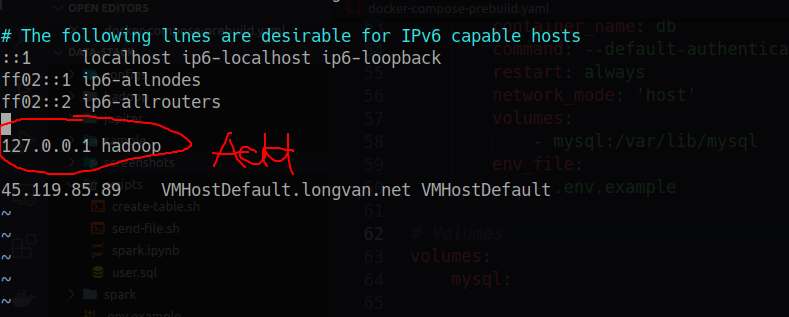
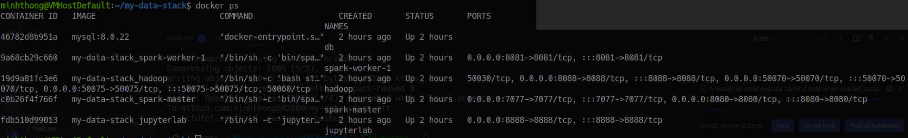
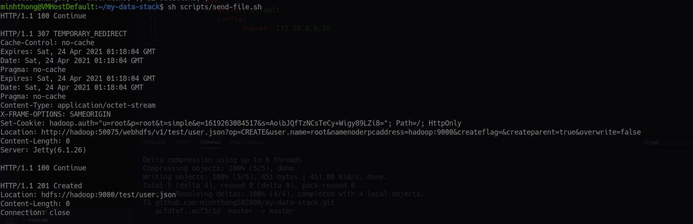
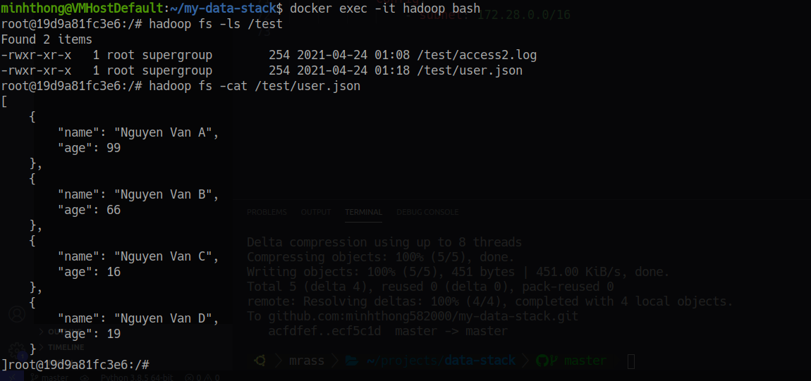
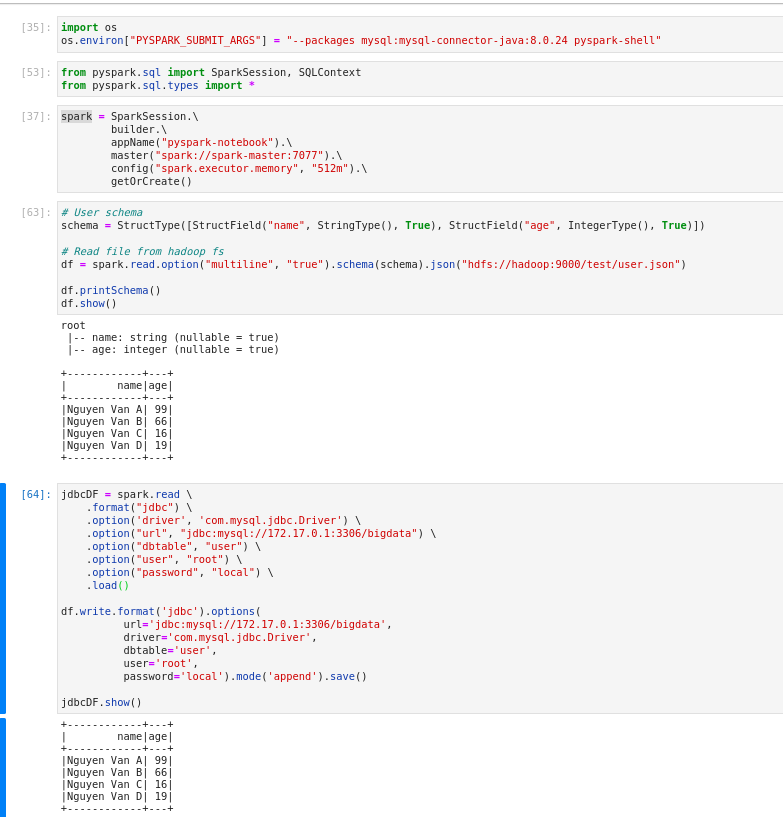
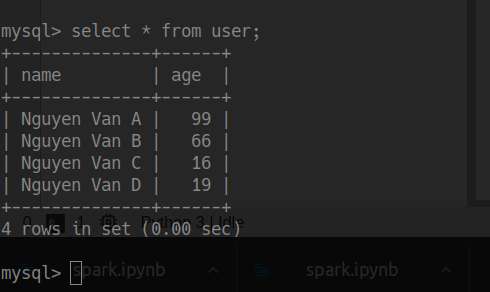

# Data Stack

Data Stack built using Docker Compose

## Getting Started

### Prerequisites

- Docker CE
- Docker Compose
- MySQL client

### Installation

### Step 1

Clone the repository.

### Step 2

Edit the host file on your machine:

```bash
sudo vim /etc/hosts
```



### Step 3

Run:

```bash
docker-compose up -d
```

Wait a moment for all services to start.

### Step 4

Run the following command to send a sample data file to Hadoop:

```bash
sh scripts/send-file.sh
```

### Step 5

Run the following command to create tables in the database:

```bash
sh scripts/create-table.sh
```

## Spark code - Reading and Writing Data from HDFS

Access Jupyter in your browser at: [http://localhost:8888](http://localhost:8888)

Run: spark.ipynb

## Demo

1. Docker ps



2. Send data file to Hadoop:



3. Create tables in the database:


4. Check the file on Hadoop:



5. Read and write data to the database:



6. Verify in the database:


